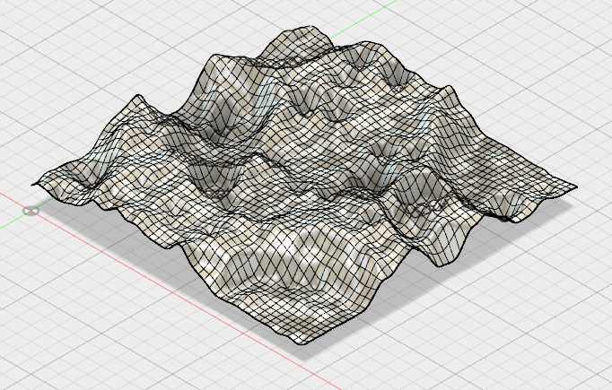
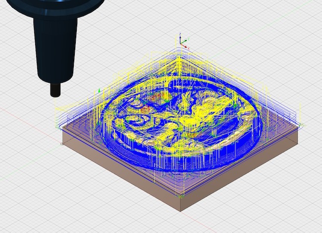
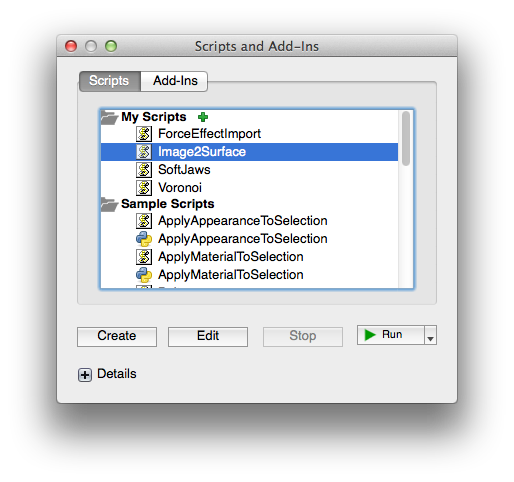
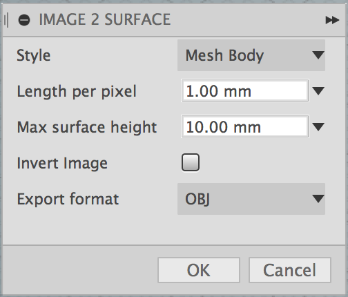
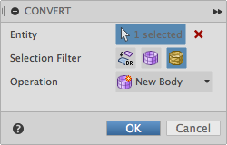
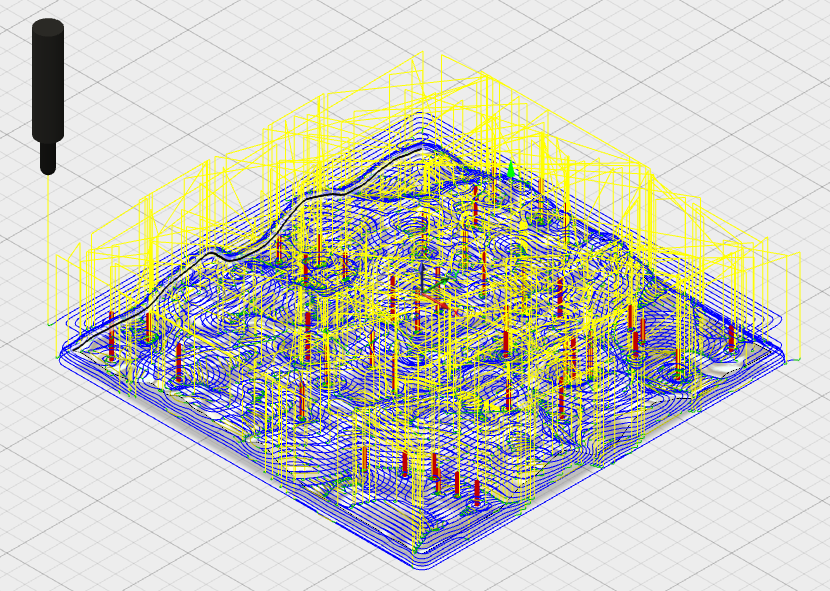

#  Fusion360Image2Surface

This is an [Autodesk Fusion 360](http://fusion360.autodesk.com/) script that's used for generating surfaces from images.

## JavaScript Add-In Support in Fusion 360

Note that JavaScript development (editing/debugging) is no longer supported within Fusion 360. But existing JavaScript add-ins, such as *image2surface* can still be installed and run.

##  Moon Surface Example

This surface was created from a small height map of a crater on Earth's moon. The first image is the mesh created from the script.The second is the T-Spline surface created from the mesh.

##  Milled Penny Example

This is a penny that was milled out of a 4"x4" block of 6061 Aluminum. The surface was created from a height map of a penny. The mesh was then converted to a T-Spline then merged onto a cube.  That model was brought into the CAM environment where the various milling operations were defined.  Finally, it was milled on a Haas CNC vertical milling machine.

## How to install an ADD-IN and Script in Fusion 360?

Please see the most recent install instruction here:

https://knowledge.autodesk.com/support/fusion-360/troubleshooting/caas/sfdcarticles/sfdcarticles/How-to-install-an-ADD-IN-and-Script-in-Fusion-360.html

And here is a Screencast video which shows how to install the script:

[Load an existing Javascript script in Fusion](https://knowledge.autodesk.com/community/screencast/b5f14cfe-e117-496d-a767-0ed801ee9b48)

## Usage

1. Enter the Model environment
2. If not in direct modeling mode, create a Base Feature that will hold the surface mesh
  - Select Create->Create Base Feature

    

3. Run the "Image2Surface" script from the Script Manager

  

4. A file dialog will be displayed.
  - Select an image file to convert to a surface and click OK.
  - Note, because of limitations in Fusion on the size of meshes, I highly recommend using only very small images. For example, the moon image used to generate the above surface is only 50x50 pixels. If you have an image that's large then create a smaller version of it then import that.

5. The settings dialog will be shown.  Adjust your preferences:

  

  - Style : Select one of the following styles to generate
    - "Mesh Body" : mesh that can be converted to a T-Spline
    - "Sketch Points" : sketch containing points for each pixel
    - "Sketch Lines" : sketch containing lines simulating a mesh (warning SLOW)
  - Mesh stepover length : The length of each face of the mesh
  - Max surface height : The maximum height the normalized image values are mapped to.
  - Invert image : Invert the height values of the image.  White is low and black is high.
  - Export format : Select one of the following
    - "OBJ" : a Wavefront OBJ file containing the mesh (quad faces)
    - "STL" : a STereoLithography file containing the mesh (triangle faces only)
6. Click OK to generate the surface
  - Note, if an OBJ or STL file with the same name as the image file already exists you will be prompted to overwrite it.

Once the mesh or sketch is created it will be added to the drawing. You might have to "fit" the view to see it.

If you have created a mesh then it's useful to convert it to a T-Spline or BRep for further modification.  Note, Fusion has a limitation on the size of the mesh that can be converted.  It's around 10K faces.

- Mesh to T-Spline

  1. Enter the Sculpt environment
  2. Select the Modify->Convert toolbar item
  3. Follow the steps in the dialog to convert the mesh to a T-Spline

    

- Mesh to BRep

  1. Enter the Model or Patch environment
  2. Select the mesh
  3. Select the Modify->Mesh->Mesh to BRep toolbar item

Note that the default settings "Mesh Body" style and "OBJ" export format are required for a usable mesh to be used in Fusion 360.  The other two styles are good for experimenting but don't create a mesh.  And the STL format only supports triangular faces, which can be used to create a mesh in Fusion, but the mesh can't be converted to a T-Spline. Note, you can use the OBJ or STL file generated in another application such as [Autodesk Meshmixer](http://www.meshmixer.com/). For example, to decimate the mesh (simplify) and then load that into Fusion 360.

Here's the heightmap image of the moon's surface that was used to generate the mesh and t-spline shown at the top of the page.

And here's the t-spline in the CAM environment being used to create toolpaths for milling:

More examples posted on my [Fusion 360 project gallery](https://fusion360.autodesk.com/users/hans-kellner).

## Issues

- 2016.02 : Fusion 360 has a 10K limitation on mesh size when converting to a T-Spline.  Any larger and it fails.
