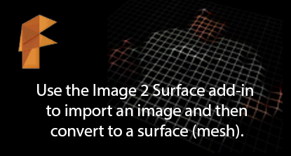
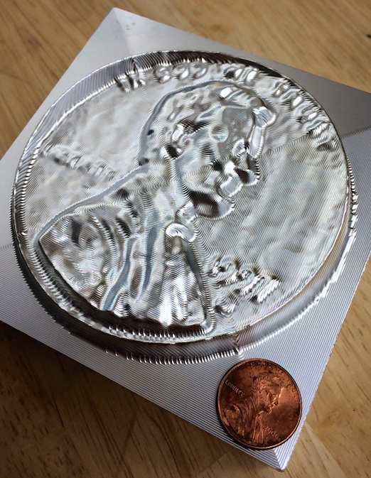
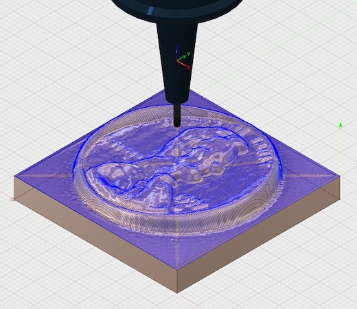
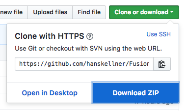
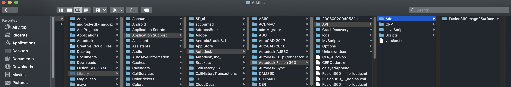
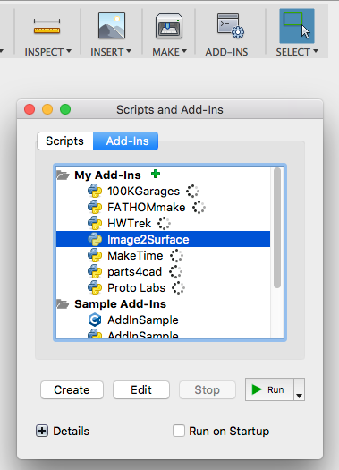
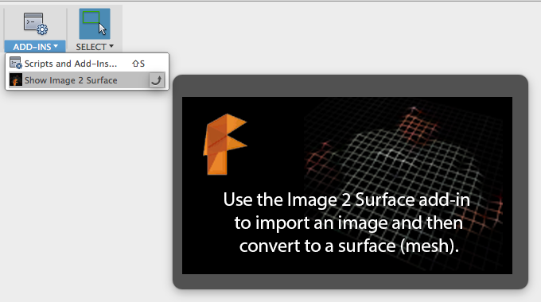
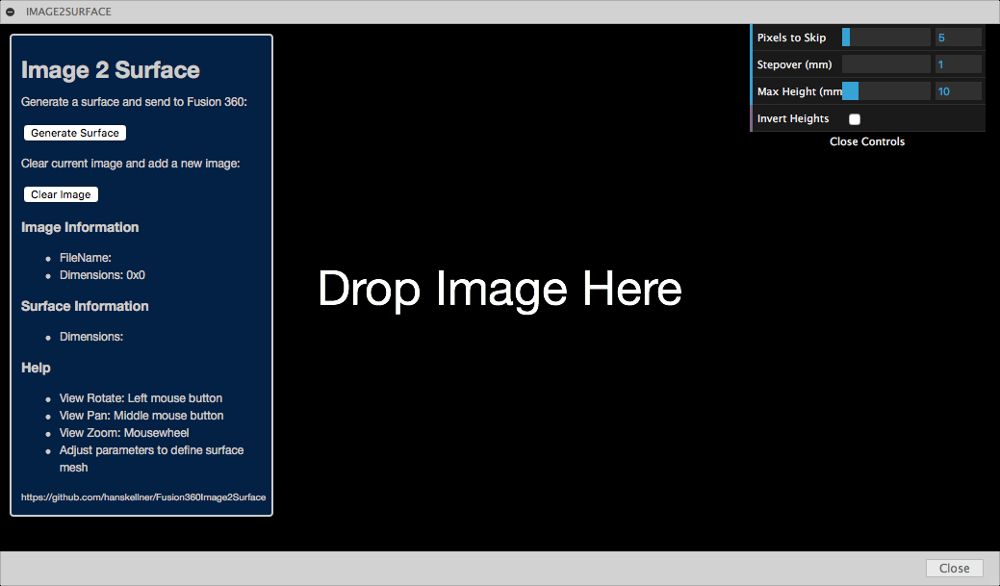
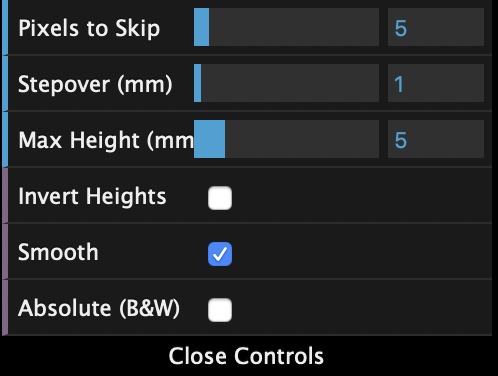
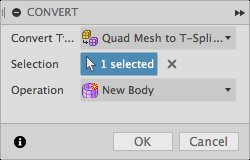

#  Fusion 360 Image 2 Surface Add-In

This is an [Autodesk Fusion 360](http://fusion360.autodesk.com/) add-in that's used for generating surfaces from images.

##  Moon Surface Example

This surface was created from a small height map of a crater on Earth's moon. The first image is the mesh created from the script. The second is the T-Spline surface created from the mesh.

##  Milled Penny Example

This is a penny that was milled out of a 4"x4" block of 6061 Aluminum. The surface was created from a height map of a penny. The mesh was then converted to a T-Spline then merged onto a cube.  That model was brought into the CAM environment where the various milling operations were defined.  Finally, it was milled on a Haas CNC vertical milling machine.

## How to install a Fusion 360 Add-In

Please see the most recent add-in install instructions here:

https://knowledge.autodesk.com/support/fusion-360/troubleshooting/caas/sfdcarticles/sfdcarticles/How-to-install-an-ADD-IN-and-Script-in-Fusion-360.html

Download the archive file (ZIP) from Github by clicking on the "Clone or download" button and then selecting "Download ZIP":

Unarchive this file into the Addins folder and once created, rename the folder created from the Zip archive name "Fusion360Image2Surface-master.zip" to "Image2Surface":

You will then be able to use the Fusion 360 Scripts and Addins Manager to add this folder, and thus the addin, to Fusion.

## Usage

1. Enter the Model environment
2. Run the Image2Surface add-in from the Scripts and Add-Ins Manager

  

3. Display the Image 2 Surface Palette.

  

  - Click on the ADD-INS dropdown and then click on the Image 2 Surface menu item.  This should display the palette.
    - If the menu item isn't there then there might have been a problem running the add-in.  Go back to step 2 and try again.
    
  
    
  - This palette window contains a preview of the surface mesh that will be generated as well as controls for adjusting the mesh.
4. Select an image file
  - Drag and Drop an image file onto the palette window.  It should be displaying the text "Drop Image Here".  If not, click the "Clear Image" button.
  - *TODO: Alternatively, click the "Open Image File" button and then select the file in the fial dialog.*
  - WARNING: overly large images may cause problems (even crash the app).  Please work with images under 1000x1000 at first.  If you would like to try larger images, please save your work first in case loading the large image causes a crash.
5. Preview the surface mesh
  - If the image is loaded correctly, it we be converted to a prelimary mesh and displayed in the view.
  - Adjust View
    - Left mouse button to rotate the view
    - Middle mouse button to pan the view
    - Mousewheel to zoom in/out
6. Adjust the mesh parameters

  

  - In the upper right of the view is small dialog containing parameters that control the mesh:
    - Pixels to Skip: This is the number of pixels to skip over for each row and column on the source image
    - Stepover (mm): This is the distance in millimeters between each mesh grid line
    - Max Height (mm): This is the max height in millimeters of each grid node.  Each node's height is based on the color of the associate image pixel.  Black maps to zero (0) and pure white to the "Max Height" value.
    - Invert: If checked then black maps to "Max Height" and pure white to zero (0).
7. Generate a surface/mesh
  - When ready to generate a mesh within the active document, click the "Generate Surface" button.

Once the mesh generated it will be added to the active drawing. You might have to "fit" the view to see it.

If you have created a mesh then it's useful to convert it to a T-Spline or BREP for further modification.  Note, Fusion has a limitation on the size of the mesh that can be converted to a BREP (around 10K faces).  With a T-Spline or BREP surface it's possible to CNC or 3D print.

- Convert the Mesh to a T-Spline

  1. Click on the "Create Form" button on the toolbar to enter the "Sculpt" environment
  2. Click on the "Utilities" button and then the "Convert" item to display the dialog:

    

  3. In the dialog, select the "Quad Mesh to T-Spline" type
  4. For the "Selection", select the mesh in the drawing then click OK

- Convert the Mesh to a BREP

  1. Enter the Model environment
  2. Select the Create->Create a Base Feature item from the toolbar
  3. Right-click/Ctrl-click on the mesh and in the context menu, select Mesh to BRep.
  4. In the dialog displayed, the mesh should already be selected.  Click OK.

Here's the heightmap image of the moon's surface that was used to generate the mesh and t-spline shown at the top of the page.

And here's the t-spline in the CAM environment being used to create toolpaths for milling:

More examples posted on my [Fusion 360 project gallery](https://fusion360.autodesk.com/users/hans-kellner).

## Issues

- 2018.03 : Need to add "Upload Image" button and file browser as alternative to D&D of image
- 2016.02 : Fusion 360 has a 10K limitation on mesh size when converting to a BREP.  Any larger and it fails.
