#  Autodesk Fusion Image 2 Surface Add-In

This is an [Autodesk Fusion](http://fusion360.autodesk.com/) add-in that's used for generating surfaces from images.

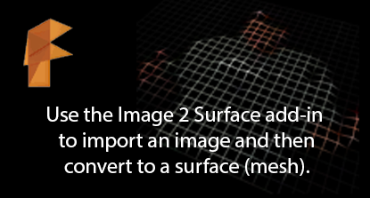

## 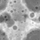 Moon Surface Example

This surface was created from a small height map of a crater on Earth's moon. The first image is the mesh created from the script. The second is the T-Spline surface created from the mesh.

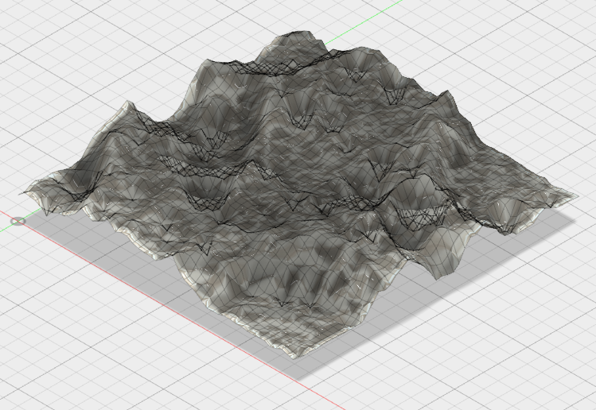

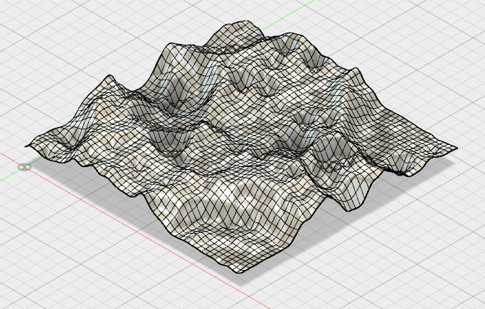

## 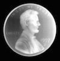 Milled Penny Example

This is a penny that was milled out of a 4"x4" block of 6061 Aluminum. The surface was created from a height map of a penny. The mesh was then converted to a T-Spline then merged onto a cube.  That model was brought into the CAM environment where the various milling operations were defined.  Finally, it was milled on a Haas CNC vertical milling machine.

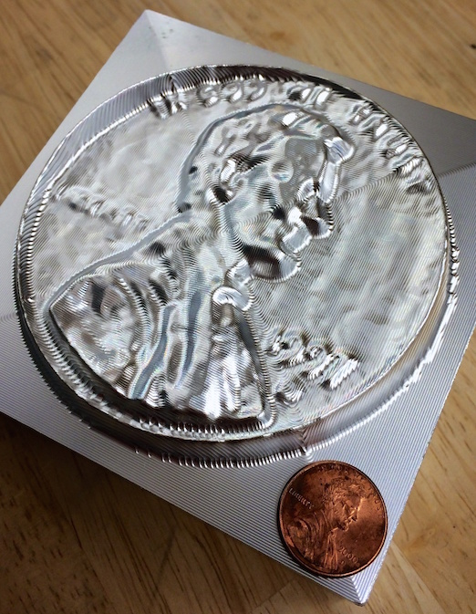

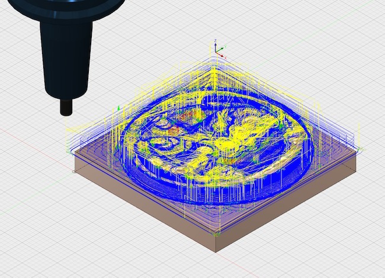

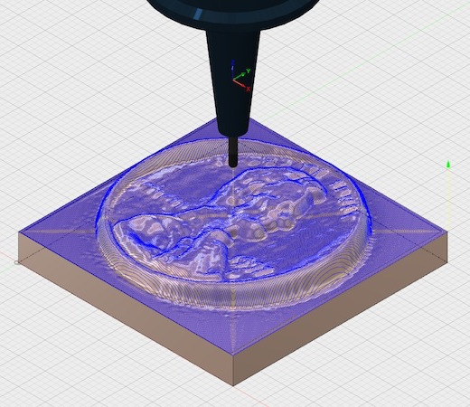

## Installation

Please see the Fusion add-in install instructions here:

https://www.autodesk.com/support/technical/article/caas/sfdcarticles/sfdcarticles/How-to-install-an-ADD-IN-and-Script-in-Fusion-360.html

If you are installing manually, then please download the archive file (ZIP) from Github by clicking on the "Clone or download" button and then selecting "Download ZIP".

Once you have the ZIP file, please follow the manual install instructions in the link above.

Note, installing the add-in into the Fusion add-ins folder allows it to be found automatically and displayed in the add-ins list.

## Usage

**Important: This add-in requires the document to be in parametric modeling mode (i.e. Capturing design history).**

1. Enter the Model environment
2. Run the Image2Surface add-in from the Scripts and Add-Ins Manager. Note, select the "Run on Startup" checkbox if you would like the add-in automatically started when Fusion starts up and avoid having to manually run each time.

  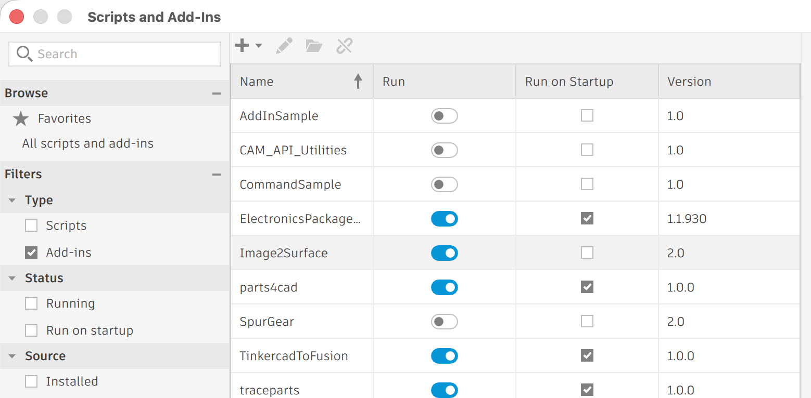

3. Display the Image 2 Surface Palette.

  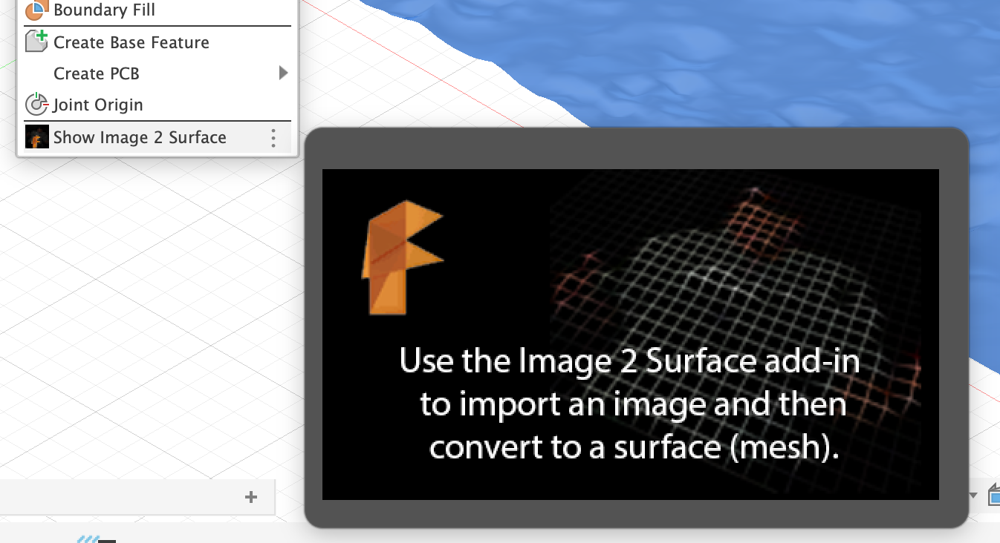

  - Click on the SOLID->CREATE dropdown and then click on the "Show Image 2 Surface" menu item.  This should display the palette.
    - If the menu item isn't there then there might have been a problem running the add-in.  Go back to step 2 and try again.
    
  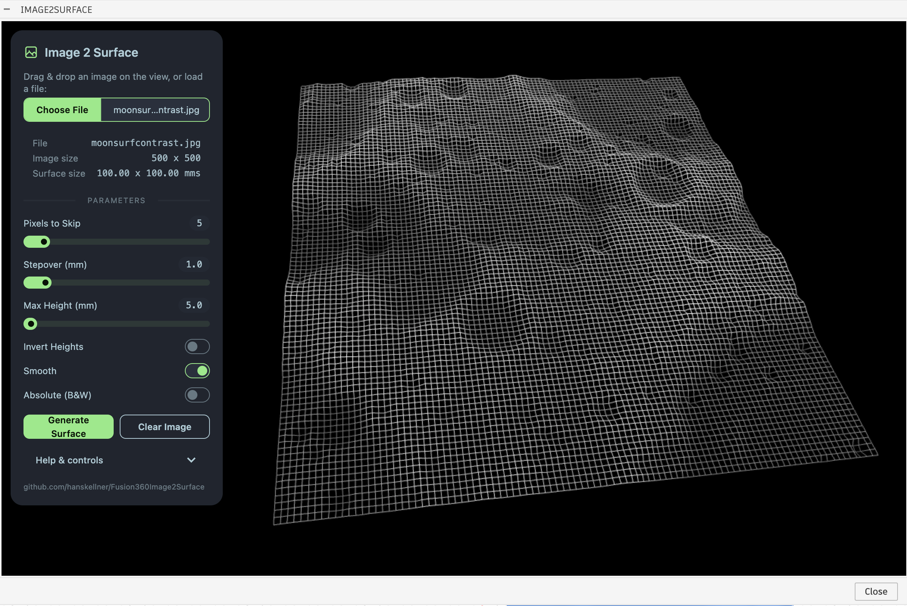
    
  - This palette window contains a preview of the surface mesh that will be generated as well as controls for adjusting the mesh.
4. Select an image file
  - Click the view (the "Click to Load Image" area) and choose an image file in the dialog. You can also click the "Choose File" button in the control panel.
    - *Drag-and-drop is also supported where the host allows it. Note: on macOS, Fusion's palette does not deliver dropped files to the page, so use click-to-load there. If the view is not showing the "Click to Load Image" prompt, click the "Clear Image" button first.*
  - Images larger than 1600x1600 pixels are automatically downsampled to keep the tool responsive. You will be notified when this happens. Even so, please save your work before loading very large images.
5. Preview the surface mesh
  - If the image is loaded correctly, it we be converted to a prelimary mesh and displayed in the view.
  - Adjust View
    - Left mouse button to rotate the view
    - Middle mouse button to pan the view
    - Mousewheel to zoom in/out
6. Adjust the mesh parameters

  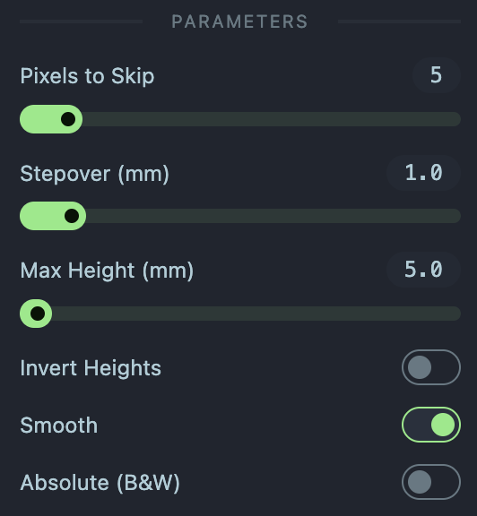

  - The length-based controls (Stepover, Max Height) use the **active document's units** (mm, cm, m, in, ft). The unit is read from the document and shown in the control labels and the surface-size readout; the value you enter is in that unit, and the generated mesh is sized accordingly. (Changing the document's units between showings updates the controls; switching units converts the current Stepover/Max Height values so the physical size is preserved, clamped to the new unit's range.)
  - In the control panel of the window are parameters that control the mesh:
    - Grid Pattern:
      - Selects the line pattern used to sample the image and build the surface. Changing the pattern updates the preview (and the generated mesh) immediately. Available patterns:
        - **Rectangular** — the classic grid of rows and columns (the default).
        - **Hexagonal** — a honeycomb of hexagons.
        - **Triangular** — an isometric / triangular lattice.
        - **Circular** — concentric rings with radial spokes, centered on the image.
      - Each pattern may add its own controls below the dropdown (for example a *Cell Size*, or the *Ring Spacing* / *Spokes* for the circular pattern). The Rectangular pattern has no extra controls.
    - Pixels to Skip:
      - This is the number of pixels to skip over for each row and column on the source image. *(Used by the Rectangular pattern; the other patterns use their own spacing controls instead.)*
    - Stepover (document units):
      - This is the distance, in the document's units, between each mesh grid line.
    - Max Height (document units):
      - This is the max height, in the document's units, of each grid node.  Each node's height is based on the color of the associate image pixel.  Black maps to zero (0) and pure white to the "Max Height" value.  Or the inverse if Invert checked.
    - Invert Heights:
      - If checked then black maps to "Max Height" and pure white to zero (0).
    - Smooth:
      - Apply a smoothing to the values to help reduce sharp ridges.
    - Absolute (B&W):
      - If checked then the height is based on the average of the pixel RGB value.  Otherwise, it takes into account the human perceptual bias of the RGB individual values.
7. Generate a surface/mesh
  - When ready to generate a mesh within the active document, click the "Generate Surface" button.

Once the mesh generated it will be added to the active drawing. You might have to "fit" the view to see it.

If you have created a mesh then it's useful to convert it to a T-Spline or BREP for further modification.  Note, Fusion has a limitation on the size of the mesh that can be converted to a BREP (around 10K faces).  With a T-Spline or BREP surface it's possible to CNC or 3D print.

- Convert the Mesh to a T-Spline

  1. Click on the "Create Form" button on the toolbar to enter the "Sculpt" environment
  2. Click on the "Utilities" button and then the "Convert" item to display the dialog:

    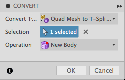

  3. In the dialog, select the "Quad Mesh to T-Spline" type
  4. For the "Selection", select the mesh in the drawing then click OK

- Convert the Mesh to a BREP

  1. Enter the Model environment
  2. Select the Create->Create a Base Feature item from the toolbar
  3. Right-click/Ctrl-click on the mesh and in the context menu, select Mesh to BRep.
  4. In the dialog displayed, the mesh should already be selected.  Click OK.

Here's the heightmap image of the moon's surface that was used to generate the mesh and t-spline shown at the top of the page.


And here's the t-spline in the CAM environment being used to create toolpaths for milling:

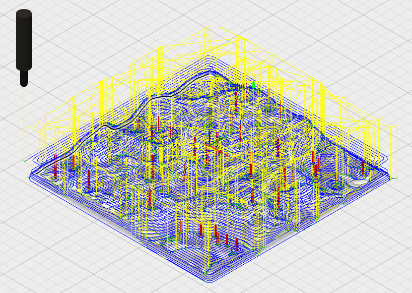

## Development

The palette UI is styled with [daisyUI](https://daisyui.com) (on Tailwind CSS) and rendered with [Three.js](https://threejs.org) (r137). The add-in itself ships **no build step and no runtime CSS tooling** — Fusion only loads the prebuilt, committed stylesheet `css/app.css`.

If you change the markup in `Image2Surface.html` (adding/removing daisyUI or Tailwind classes), regenerate the stylesheet:

```bash
npm install          # one-time: installs the Tailwind CLI + daisyUI (dev only)
npm run build:css    # regenerates css/app.css from src/tailwind.css
# or, while iterating:
npm run watch:css
```

`package.json`, `src/tailwind.css`, and `node_modules/` are development-only and are not required at runtime. The theme (modern dark "dim", with "night" for OS dark mode) is configured in `src/tailwind.css`.

The parameter controls are plain HTML `range`/`checkbox` inputs (daisyUI `range` / `toggle`) wired to the surface generator in `js/image2surface.js`.

The grid patterns are modular: each lives in its own file under `js/gridpatterns/` and self-registers with the `GridPatterns` registry. Adding a new pattern is a matter of dropping in a new file and a `<script>` tag — see [`docs/GRID_PATTERNS.md`](docs/GRID_PATTERNS.md) for the generator contract.

## Trouble Shooting

- Add-in fails to load.  Verify that the add-in has been placed in its own folder within the Addins folder.  If the files are not placed in their own folder then Fusion will tend to fail loading the add-in.
- Large images can create large meshes which can cause Fusion to take a very long time to process.  Or the app may just fail.  Try using a smaller resolution image. 

## Issues

- The v3 update uses ThreeJS loaded remotely from CDN.  Therefore, code will not work if computer is offline.  Plan to update so ThreeJS files are stored so offline mode supported.
- 2016.02 : Fusion has a 10K limitation on mesh size when converting to a BREP.  Any larger and it fails.
